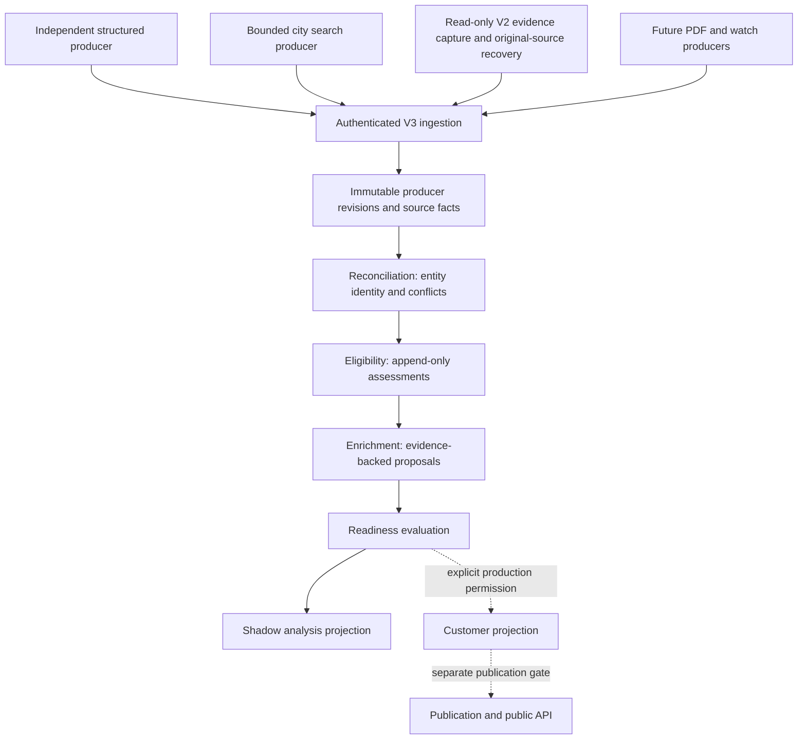

# FindPitches V3 architecture

Status: proposed architecture adopted for the isolated shadow implementation. Publication and customer cutover remain disabled.

## Evidence and scope

Inspected the existing checkout at `ffd186acfb20c20f1532c3b39c8a69828bf338a8` and the structured-feed branch at `d111f9493300b3f4b94075cca46f99583fa8f7b9`. The remote advertises the protected V2 reference at `5460d9df178ae7b3e479f34c7abc1012fb948cff`; that separate tip was not inspected. The V3 handover is the product specification; historical metrics are not current production measurements.

V2's `classifier/run-batch.mjs` refetches a candidate using only its canonical URL and title, then overwrites `application_url`, `event_name`, `organiser`, `geography_json`, and `evidence_json`. Its customer promotion batch selects validated candidates with current enrichment, without a structural test/shadow discriminator. These explain the handover's destructive-field and pilot-projection failure mechanisms.

| V2 concept | V3 decision |
| --- | --- |
| Structured export contract and independent producer | Adapt the contract at the boundary; retain the original payload unchanged. Producer gets no D1 credentials. |
| Matcher-v5's platform IDs, date editions, corroboration | Adapt the rules into an independent V3 reconciler; no V2 imports. |
| Granular city query families | Port one bounded US city lane only after the preservation gate passes. |
| Leases, retries, dead letters, scheduler visibility | Reimplement with lease tokens, bounded attempts, durable D1 jobs, and queue wakeups. |
| PDF recovery | Keep a separate future producer boundary; do not embed PDF extraction in classification. |
| Mutable candidate identity and classifier extraction | Discard. Classification writes assessments only. |
| Status-driven customer promotion | Discard. Readiness, projection permission, and publication permission are separate. |
| Customer read-side ideas | Adapt as rebuildable projections; no dependency on V2 tables or services. |

No V3 runtime imports V2 code, uses V2 schema, binds V2 D1, calls V2 services, or writes existing public datasets. V2 snapshots may be supplied as read-only files to the comparison harness.

## Stage ownership

Discovery supplies evidence; reconciliation links identity; classification assesses eligibility; enrichment proposes facts; readiness determines suitability. Neither rejection nor closure deletes earlier evidence. WATCH remains a first-class state. A source fact and the current selected value are different objects.

The independent structured producer continues exporting `findpitches-discovery-export-v1` (JSONL). A boundary adapter emits `findpitches-evidence-v1`, retaining the entire raw record, evidence, provenance, producer ID, platform ID, URLs including identifying query parameters, dates, and content fingerprint. Its logical name is `independent-structured`; it never imports V3 internals or receives V3 database credentials. The importer is a consumer of that export, not a replacement discovery implementation.

## D1 schema

All tables below belong exclusively to `findpitches-v3-shadow` / `FINDPITCHES_V3_DB`. D1 batches provide atomic commits; do not send manual BEGIN/COMMIT through the D1 API.

| Table | Key and purpose |
| --- | --- |
| `producer_records` | Content-addressed revision ID; producer name/record ID, environment, raw JSON, normalized JSON, content hash, validation outcome, arrival time. Append-only, including rejected input receipts. |
| `source_facts` | Fact ID, record revision, field, exact JSON value, authority, evidence/provenance, source URL. Append-only. |
| `entities` | Canonical ID, market, edition, environment, shadow flag, promotion/publication permission, revision and timestamps. Contains identity/control metadata, not mutable event facts. |
| `entity_records` | Unique revision-to-entity link; separate from the retained raw record. |
| `identity_keys` | Indexed environment/market/platform/URL/title keys to bound candidate lookup. Identifying parameters are preserved; generic platform paths are not sufficient identity. |
| `field_selections` | Entity + field → source fact ID. Values are derived by joining immutable facts. SQL guards reject weaker replacements. |
| `selection_audit` | Append-only proposed fact, selected predecessor, authority decision, and reason. |
| `reconciliation_decisions` | Append-only per-revision identity result, candidate IDs, and reason. Uncertainty becomes CONFLICT/REVIEW_REQUIRED, never a forced merge. |
| `conflicts` | Entity/record/field evidence conflicts and explicit resolution state. Unresolved conflicts block readiness. |
| `assessments` | Entity revision + ruleset, eligibility/state/reasons/scores; classifier has no selected-fact update path. |
| `enrichment_proposals` | Proposed value/fact, evidence, authority and accepted/rejected/conflict outcome. Proposal processing never changes the original fact. |
| `readiness` | Entity revision, ready/watch/blocked state, reasons and snapshot hash. |
| `shadow_projections` | Rebuildable analysis view for test/shadow records, segregated from customer projection. |
| `customer_projections` | Production-only derived view; INSERT/UPDATE triggers require non-shadow production provenance, explicit promotion permission, current readiness, and no conflict. |
| `jobs` | Stage + idempotency key, payload, ready/leased/complete/dead, attempts, available_at, lease_until, lease_token, last_error, timestamps. |
| `queue_dispatches` | Coalesced wake-up timestamp per durable job; duplicate pointers cannot create another write/fan-out cycle. |
| `quality_gates` | Audited structured 100-record preservation result and hash. Required before city acquisition. |
| `recheck_requests` | Due producer rechecks with an exact request timestamp for safe acknowledgment. |
| `acquisition_runs` | Planned bounded query count, run outcome, completed queries and import results. |
| `serper_policy` | Bulk disabled; hard query/credit ceilings per run, rolling hour and London calendar day; automatic/manual pause and optional unit credit price. |
| `serper_usage`, `serper_run_records` | Atomic reservation before every paid request, observed credits where returned, timestamps and producer/lane/market/region; immutable receipt attribution for yield/cost. |
| `legacy_recovery_runs` | Read-only snapshot manifest, rule revision, expected count, completion and explicit supersession. |
| `legacy_recovery_records`, `legacy_recovery_claims` | Immutable per-unit hash, reference IDs, recovery category/reason, reconstructed receipt link and field repair audit; atomic replay claims. |
| `legacy_quality_holds` | Append-only source-qualification holds; retained evidence remains intact, while held selected facts block readiness. |
| `publication_queue` | Reserved separately gated outbox. In this phase SQL rejects all publication inserts/updates. |

Immutable-record/fact UPDATE and DELETE triggers and INSERT OR REPLACE guards protect evidence even if a downstream developer accidentally issues destructive SQL. Fact selection requires entity membership, never replaces a higher-authority fact, and records all alternatives. Equal-authority static disagreement raises an explicit conflict. A newer explicit lifecycle transition from the same producer record can select updated application/lifecycle state, retaining the prior facts. Equal values provide corroboration. Missing fields can be filled; stronger supported facts can replace lower-authority selections while both facts remain retained.

Authority comes from the server-owned producer registry, not client-supplied scores: structured platform 100, direct form 95, official page 90, official PDF 85, trusted directory 75, extracted page 60, search snippet 50, inference 40. Low-authority form fragments cannot replace a structured location or application URL. Stronger evidence with the same value upgrades its selected authority, preventing a later medium-authority disagreement from replacing that value. Correcting a strong structured fact requires stronger authorized evidence or a future explicit human resolution; no silent tie-breaking.

Identity rules separate different known event years/editions and different platform identifiers. Distinct same-year dates remain separate unless a specific exact route/ID establishes identity; contradicting facts then require review. Generic titles, shared organisers, and platform landing paths alone do not merge events. Probable matches require meaningful shared name tokens and organiser/location corroboration and remain reviewable. Market and test/shadow environment are part of the identity namespace.

## Cloudflare resource map

All Worker names and queues start with `findpitches-v3-`; no live custom domain or V2 binding is configured. All share the new V3 D1 database. Role configurations have only their stage's queue consumer and its next-stage producer bindings.

| Worker | Role | Queue / schedule |
| --- | --- | --- |
| `findpitches-v3-ingest-shadow` | Authenticated structured import; immutable records/facts and reconcile outbox | Produces reconcile wakeups; no acquisition cron |
| `findpitches-v3-reconcile-shadow` | Identity/linking and selected facts | `findpitches-v3-reconcile-shadow`; minute sweep |
| `findpitches-v3-eligibility-shadow` | Eligibility and application-state assessments only | `findpitches-v3-eligibility-shadow`; minute sweep |
| `findpitches-v3-enrichment-shadow` | Non-destructive proposal processing | `findpitches-v3-enrichment-shadow`; minute sweep |
| `findpitches-v3-readiness-shadow` | Readiness and isolated shadow projection | `findpitches-v3-readiness-shadow`; minute sweep |
| `findpitches-v3-acquisition-shadow` | One bounded US city producer, initially disabled | `findpitches-v3-acquisition-shadow`; fifteen-minute schedule |
| `findpitches-v3-watch-shadow` | Recheck scheduling; retain WATCH/CLOSED evidence | `findpitches-v3-watch-shadow`; hourly schedule |
| `findpitches-v3-api-shadow` | Health/status and authenticated analysis reads | No cron; publication API disabled |

One new dead-letter queue `findpitches-v3-dead-shadow` receives exhausted transport deliveries. A separate reserved `findpitches-v3-publication-shadow` queue has no publisher or consumer in this phase. D1 jobs, not transport messages, are the source of truth; cron sweeps recover a missing wakeup. Jobs use atomic conditional claims, lease tokens, expiry recovery, bounded retry/backoff, and explicit dead-job requeue. Stage writes are deterministic/idempotent, so repeated delivery and a crash between work and acknowledgment are safe. Queue consumers reject messages for another stage.

Each consumer has maximum concurrency one. Wake-ups are atomically coalesced for five minutes, and completed/leased duplicate pointers are acknowledged without another claim or fan-out. Source-field selection is a bounded atomic batch of at most 14 distinct fields; each field retains its authority, conflict, lifecycle and concurrent-update checks. This preserves immutable facts and selection audit while avoiding a database round trip for every field.

Mutation endpoints require role-specific ingest/operator secrets; health/status expose only aggregates. Raw evidence and shadow projections require operator authorization. `/v1/opportunities` fails closed while publication is disabled, even if an environment variable is accidentally set to true. Initial runtime accepts only shadow/test input and sets promotion/publication eligibility false independently of client input.

## Implementation and acceptance sequence

1. Commit architecture, independent schema, role layouts, isolated migration tooling and health/status skeletons.
2. Implement structured adapter, immutable evidence, identities and queues. Extract a deterministic 100-record control sample from the pinned 1,599-record structured artifact, including Eventeny vendor 52126 and the available platform families.
3. Run that sample through reconciliation, classification, adversarial enrichment, readiness and replay. Assert zero raw/fact/selected-source-field mutations, zero customer/publication leakage, and unchanged entity count on replay. SQL tests must reject destructive evidence edits. Store the gate result. **Do not add or enable city acquisition before this passes.**
4. Finish eligibility, additive enrichment, readiness, shadow projection, retry/lease/dead-letter behavior, authenticated APIs and status telemetry. Test authority upgrades, equal-authority conflicts, identity/date/platform corner cases, and production projection guards.
5. Port one bounded US city query producer into the same V3 envelope. Default disabled; require the preservation gate, a search credential, an explicit query budget and an approved city. Verify with recorded provider responses before any paid request.
6. Build file-based V2/V3 comparison reports for equivalent producer IDs: discovery, valid/reject/watch rates, gold-label false rejection where labels exist, duplicates/conflicts, field retention and completeness, readiness yield, provider costs and processing timings. Missing V2 snapshots or labels are reported as unavailable, never fabricated.
7. Validate real D1-compatible SQL, Node tests, Worker bundles, and local runtime functional requests. Provision only the new resources when credentials are available. No V2 deployment, deletion, customer cutover, publication enablement or protected-branch merge is part of this phase.

The controls use real producer-backed records. The first control reconstructed failure categories from a deterministic reference sample. The actual 100 pilot IDs and frozen audit were subsequently recovered with SELECT-only reference queries and verified against the pinned source artifact; both samples pass V3 adverse extraction. See the comparison guide for observed field coverage and remaining truth/cost limitations. Preservation remains a prerequisite for broader acquisition.

Cloudflare resources and the Serper binding are configured. The producer-host installer was transferred and its first live delivery reached V3. The single-query city canary completed; its grant is revoked. Publication and paid bulk acquisition remain disabled.

## Implementation status

The greenfield shadow implementation now includes all eight role configurations, the independent structured importer, immutable evidence and guarded field selection, reconciliation, eligibility, supported enrichment proposals, readiness/analysis projection, native queue delivery with durable jobs/cron recovery, watch/recheck handling, the disabled bounded Austin producer, comparison tooling and a V3-only CI workflow. The real 100-record preservation control passed before city integration. The [operating runbook](findpitches-v3-runbook.md) describes validation and guarded new-resource deployment.

Remote provisioning completed on 6 October 2026 after the environment policy was published. The new database is `findpitches-v3-shadow` (`75ccfd1a-f136-4598-8cfb-9a4489d174b9`); all eight Workers and eight queues are deployed. The [resource audit](../operations/findpitches-v3/reports/remote-resource-audit-2026-10-06.json) records actual bindings, consumers, retry/dead-letter settings, schedules and URLs. The deployed real 100-record control and final re-audit passed with zero mutations/customer/publication rows. No V2 mutation, production cutover or publication has been performed.

The standalone delivery client and runner support JSON/JSONL, directory exports, bounded batches, checkpoint resume and producer-addressable rechecks with freshness guards. The [delivery guide](findpitches-v3-continuous-delivery.md) supplies the installed host's 15-minute Windows schedule and a portable service template. The first 887 live records were verified against an immutable pre-recovery receipt/fact baseline. Unchanged-file delivery is idempotent; it does not create new receipt arrival timestamps. The [comparison guide](findpitches-v3-comparison.md) records the recovered actual pilot at its historical clock. Serper is stored only on the V3 acquisition Worker. One live Austin query produced 10 accepted records through reconciliation/readiness; its temporary grant is revoked and bulk acquisition remains disabled. Independent truth, historical V2 readiness/replay and equivalent cost measurements remain incomplete.

The [Serper safeguards](findpitches-v3-serper-usage.md) apply to every future paid request: four queries/credits per run, 100 per rolling hour and 1,000 per London calendar day, including canaries. These are ceilings; bulk remains disabled. The [legacy recovery lane](findpitches-v3-legacy-recovery.md) reconstructs `legacy_v2` evidence from retained source material or direct original URLs. V2 customer fields are comparison material only. Retained structured authority 85 and direct Event authority 90 cannot override independent structured authority 100. Unsupported sources and uncertain identity remain quarantined, and all recovery is shadow-only pending audit.
