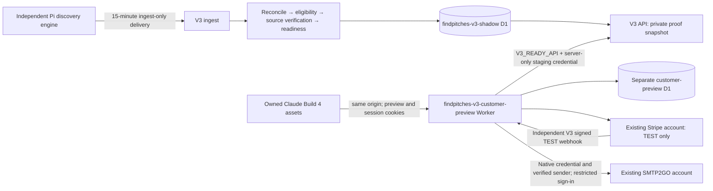

# V3 customer architecture — owned Build 4 preview

Current implementation: 10 October 2026. The authoritative standalone handover is now copied into `web/findpitches-v3-web`; the native V3 customer service is deployed as a restricted shadow preview. [The 9 October verification report](findpitches-v3-customer-preview-2026-10-09.md) replaces the earlier preparation-only conclusions. [The native-mail follow-up](findpitches-v3-email-setup-2026-10-10.md) records credential and invitation validation; [reviewed TEST recognition and native browser evidence](findpitches-v3-subscriber-recognition-2026-10-10.md) records the latest customer deployment. [The 16:38 checkpoint](findpitches-v3-customer-preparation-2026-10-09.md) remains historical evidence.

## Runtime and resource map

| Resource | Implemented responsibility | Isolation |
| --- | --- | --- |
| Eight `findpitches-v3-*-shadow` Workers, queues and evidence D1 | Discovery receipts, identity, source verification, readiness, rechecks and budgets | No live routes; publication and paid acquisition disabled |
| `findpitches-v3-customer-preview` Worker | Owned static assets, full Build 4 Finder, native `/api/v3/*`, clean routes and SEO metadata | Preview gate on pages/assets/inventory; workers.dev only; no production route |
| `findpitches-v3-customer-preview` D1 | Native customers, hashed challenges/sessions, saved items, alerts, inbox, Stripe mappings, webhook receipts and inventory changes | Separate database; no V1 KV or V2 customer store |
| `V3_READY_API` service binding | Private `/staging/catalogue` source-proof snapshot | V3 API only; separate server-only staging credential |
| Own session/operator secrets | Signed CSRF, opaque native sessions and restricted preview grants | Dedicated V3 bindings; never browser assets or local storage |
| Existing Stripe TEST key/approved GBP £4.99 monthly price | Seven-day trial Checkout, canonical entitlement, separate test portal and test webhook | No live key/customer/subscription/price changes or production endpoint redirection |
| Existing SMTP2GO account, V3-owned key/sender bindings | Native passwordless email service | Deployed credential and sender domain verified; one authorised message delivered and native sign-in confirmed; no V1 lookup |

Only `public/` is deployed. Supplied `dev/` fixtures and stub server are retained as local contract/UI test material. The fixture's 1,903 rows are never imported as customer inventory. Server taxonomy and SEO are physically owned copies; no runtime import from the dev stub is allowed. CI bundles all nine owned Workers and checks runtime boundaries.

## Frontend source custody

The user-uploaded ZIP has SHA-256 `24ad4b61cfc64b7338d5ab44efa816479ad1a57e7e0740893fb338b39c8b3e05`. All 76 supplied manifest entries matched. The archive contains no Git commit, so `source_commit` is null rather than invented. `source-custody.json` records original file checksums; deliberate V3 changes are reviewable in this branch.

Approved product policy: search is free; application/source links and alerts require a market-scoped Pro/trial entitlement. The homepage says “Checked against event, organiser and application sources.” The full Build 4 Finder, bundled fonts, page design and SEO routing remain the foundation. There is one native API client and no alternate Finder.

The user's explicit instructions to reuse existing Stripe/SMTP2GO accounts take precedence over the attachment's proposed separate-account wording. V3 owns credentials/configuration, storage and endpoints; account reuse does not create a V1 runtime dependency. Retained legacy evidence and other free V3 sources remain valid inputs; the attachment's Pi-only proposal does not replace the user's source-diversity objective.

## Customer data and evidence policy

`/staging/catalogue` returns only current, revision/version-matched, source-proved commercial READY entities. It additionally withholds the latest independent-producer LOW-confidence, non-current or non-READY revisions. The native customer service validates snapshot scope/timestamp, source-proof expiry, stable `ent_…` identity and supported application state again.

Unknown event type, vendor categories, fees and coordinates remain null/empty. No producer category, query city or postcode guess is upgraded into verified geography or suitability. Regions use an explicit proved code or an unambiguous literal region in proved location text. Postcode/radius is unavailable until supported geocoding exists. Literal place search, proven regions, title text, dates, sort, pagination and detail work.

Free/cross-market access is redacted server-side. Native responses never contain raw source receipts, conflicts, private credentials or operator telemetry. Saved IDs can be read without a source fetch; expanded saved records still require fresh source proof. A proof-expired, closed, withdrawn or held entity is unavailable immediately, independently of asynchronous change-log updates.

The separate customer change log tracks bounded inserts/updates/removals. Its five-minute sync processes at most 100 entity operations per pass. It is telemetry, not a cached authority for customer access, and never writes evidence or identity. Proof renewal alone does not manufacture a new listing.

## Native API and customer schema

The implemented contract is [V3_CUSTOMER_API.md](../web/findpitches-v3-web/contract/V3_CUSTOMER_API.md), with [source-proof implementation notes](../web/findpitches-v3-web/contract/V3_IMPLEMENTATION.md).

| API family | Native behaviour |
| --- | --- |
| `/session`, `/session/link`, `/session/verify`, `/session/logout`, `/session/profile` | Passwordless challenge, opaque revocable session, safe redirect, bounded login rates, editable preferences |
| `/markets`, `/stats`, `/regions`, `/geo/resolve` | Owned market/taxonomy configuration and truthful proved inventory counts; no inferred coordinates |
| `/opportunities`, `/count`, `/upcoming`, `/by-ids`, `/:id`, `/changes` | Source-proved search/detail, stable pagination and bounded changes cursor |
| `/saved`, `/alerts` | Native customer-owned persistence; expired items are withheld on expansion; alert email delivery remains off |
| `/billing/plans`, `/checkout`, `/confirm`, `/portal`; `/stripe/webhook` | TEST mode only; exact owner/price/mode validation, duplicate protection and signed canonical reconciliation |
| `/seo/inventory`, `/inbox/*` | Owned SEO counts, organiser submissions, enquiries, reports and waitlist storage |

Customer migrations create `customers`, `login_challenges`, `customer_sessions`, `preview_access`, `customer_rate_limits`, `stripe_customers`, `stripe_subscriptions`, `checkout_attempts`, `checkout_reservations`, `stripe_webhook_receipts`, `saved_opportunities`, `customer_alerts`, `customer_inbox`, `customer_operation_events`, `preview_inventory_state` and `preview_inventory_changes`. Migration 0003 adds immutable `subscriber_associations` and `subscriber_recognition_decisions` for reviewed synthetic TEST ownership. The operator-only `/preview/subscribers/recognize` route validates canonical provider ownership and custody before associating it; real customer import remains unavailable. No live subscriber records have been copied.

Session and preview cookies use `__Host-`, Secure, HttpOnly, SameSite=Lax and Path=/. Storage keeps only token hashes. Challenges expire after 15 minutes and consume atomically once; sessions expire after seven days and revoke server-side. Browser writes require an HMAC-signed cookie/header token and exact same origin. Responses use private/no-store, restrictive CSP and noindex; shadow robots disallow crawling and sitemaps contain no discoverable listings.

GET challenge verification is reachable without an existing preview cookie so an invited mailbox can open its one-use link in another browser. Challenges are still issued only through authorised preview requests or its operator. Only a successfully consumed challenge establishes a bounded preview grant; invalid/replayed tokens grant nothing. Verification has a durable 30-per-minute IP limit. The operator-only mail-provider check verifies the deployed key without sending mail or exposing credentials.

## Stripe entitlement and test boundaries

Canonical Stripe customer metadata must match native customer ID and verified email for normal native ownership. A reviewed synthetic TEST association may instead bind the exact retained legacy vendor/customer/subscription identity, without rewriting provider metadata. Email alone never authorizes this exception. Only the approved TEST price grants GB access. Active/trialing subscriptions require a future authoritative period end and a fresh canonical check; past-due, unpaid, incomplete, paused, immediately cancelled, stale or cross-market state fails closed. Scheduled cancellation preserves paid-through access.

Checkout uses a durable customer reservation across concurrent requests/calendar boundaries plus provider idempotency. An existing active/trialing/payment-problem subscription prevents a second subscription. Reviewed recognized accounts cannot start ordinary Checkout, including after expiry; renewal needs an explicit separate path. DB triggers guard concurrent review/reservation races and ownership rebinding. Previous trial history prevents another trial. Confirmation checks mode, exact owner and completed canonical subscription. No access comes from a client-supplied Checkout ID alone.

The owned test portal uses a separate configuration with cancellation at period end. TEST webhooks verify the raw payload, timestamp and signing secret, deduplicate durable event IDs and reread current canonical subscriptions. Out-of-order cache writes cannot replace a newer canonical check. The existing production webhook remains unchanged.

The [genuine hosted TEST journey](findpitches-v3-hosted-customer-journey-2026-10-10.md) passes 22 browser checks: native sign-in, actual hosted card Checkout, return, trial/Pro, actual portal cancellation, paid-through and TEST-clock ended/redacted access. One hosted-created subscription is retained; no API-created replacement or cache/date edit. Existing environment CA trust is constrained to exact required hosts in one disposable profile, without certificate bypass or global trust changes. Synthetic recognition's earlier 16 deployed checks are separate evidence. Actual customer migration and live billing remain gated by the [acceptance package](findpitches-v3-subscriber-acceptance-2026-10-10.md).

Account/pricing presentation uses additive server-derived `checkout_allowed`, `trial_eligible` and `billing_review_required`; returning history never promises a second trial and recognized/unverified owners never see ordinary Checkout as a fallback. The backend independently enforces these rules.

## Producer lifecycle, independence and remaining launch gates

New closure aliases are additive interpretations of immutable producer receipts. CLOSED_CURRENT_CYCLE/HISTORICAL become internal CLOSED; UPCOMING_NOT_OPEN and held/watch states cannot be READY; retired becomes WITHDRAWN. An UNCHANGED first-delivered closure is still interpreted as CLOSED. Original source fields/receipt JSON are never overwritten. A stable producer ID whose platform identity changes requires review rather than silently creating/relinking an entity.

Pi delivery and the lifecycle feed are active; the cloud supports all-page recheck pagination and fresh, exact-ID acknowledgement custody. Claude records Chris's installation of the all-page kit; execution/deferred counts from its first full cycle remain open. The initial 119 lifecycle receipts linked existing entities and were withheld; six equal-source-clock conflicts retain exact rechecks for genuine stronger evidence. Missing from an export never means closed. Aggregate health allows three-hour discovery plus one-hour lag; individual proof expiry is unchanged. See [cloud checkpoint](findpitches-v3-lifecycle-cloud-checkpoint-2026-10-10.md) and the latest [hub handovers](../team/HANDOVERS.md).

The frontend/API/auth/test-billing runtime has no required V1/V2/old frontend dependency. Browser tests see only V3, and canonical subscription reads go directly to Stripe. Original-source verification uses external event/application sources, not legacy customer databases. V1 remains live and unchanged; V2 is read-only.

The supplied frontend archive did not contain the producer engine or Pi source. Claude has since completed source custody in the logically separate [producer package](../producer/README.md); custody is distinct from proving host execution. Native sign-in mail has passed one authorised end-to-end test; hosted TEST billing is now proved. Remaining launch work includes active lifecycle/recheck completion, alert delivery, actual canonical subscriber/product/price continuity and gated migration, stronger UK source breadth, supported facets, final performance/security review and explicit production/domain/publication approval. An unconditional whole-product “delete V1/V2 tomorrow” claim is not yet supported.

Rollback revokes/disables only owned preview grants/sessions and restores the prior owned Worker version while retaining D1 and all evidence. Do not delete infrastructure, change V1/Stripe production delivery, restore paid flags, merge protected branches or route production during preview work.
