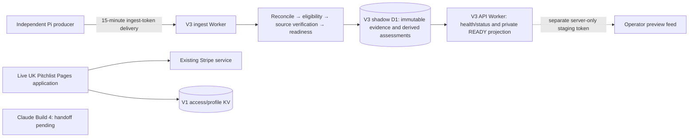
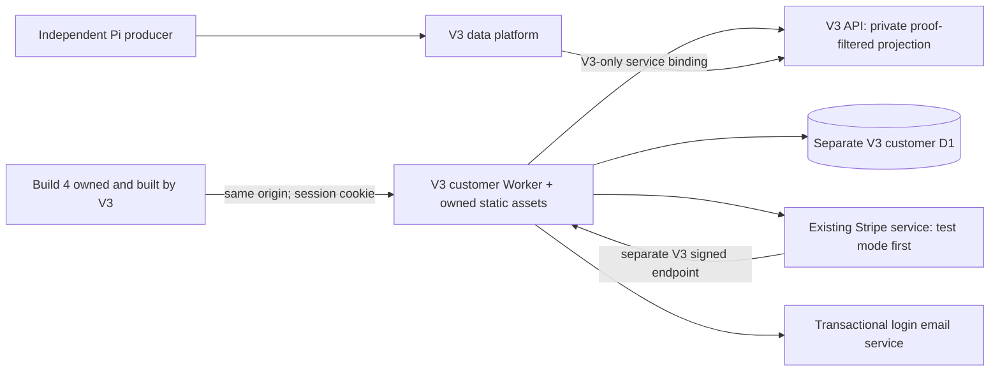

# V3 customer application: architecture and implementation contract

Checkpoint: 9 October 2026. This is the design prepared before Claude's authoritative Build 4 handoff. The frontend has not been identified, copied, inspected as a migration candidate or integrated. The subscriber service described below is not implemented or deployed. Existing V1 remains live and unchanged; V2 remains read-only.

## Current architecture

| Component | Verified current state | Customer consequence |
| --- | --- | --- |
| Execution | Eight V3 shadow Workers; six processing stages; durable jobs and eight queues including the dead-letter queue | Data pipeline exists; it is not a subscriber application |
| Storage | `findpitches-v3-shadow`, independent D1; append-only receipts/facts/documents/verifications; immutable market/edition and receipt/entity links | Legacy deletion does not remove retained V3 evidence |
| Customer projection | `customer_projections` and publication queue exist but contain zero rows; publication policy is constrained to false | Zero live/customer publication |
| Private API | `/staging/ready`, separate staging credential; sanitized, current source-proved READY only; country/region/location and bounded cursor pagination | Server-to-server preview foundation, without subscriber auth, search/detail or billing |
| Disabled API | `/v1/opportunities` always returns 403 | Environment flags cannot accidentally publish shadow data |
| Credentials | Ingest-only credential on ingest; operator credential for administration; staging read credential on API; Serper only on acquisition | None belongs in frontend assets or browser storage |
| Customer storage | No V3 customers, auth sessions, subscriptions or Stripe webhook tables/services currently present | Must be implemented inside V3 |
| Auth / billing | No V3 subscriber login, entitlement service or Stripe webhook binding | Subscriber testing is not ready |
| Frontend | No positively identified Build 4 handoff | Copying/integration is blocked |
| Monitoring | `/health`, `/status`, commercial inventory, delivery, verification and paid-budget telemetry | Added application-preparation and producer acknowledgement state distinguish inventory health from launch readiness |
| Deployment | Owned `findpitches-v3-*-shadow` workers.dev endpoints; no live routes; feature-branch deployment tooling | Reversible isolated deployments; no V1 Pages deployment |

V1 reference code was compared with the deployed build commit `325d65dde304abc6288d48e468e28299eeef7eb3`: the inspected Stripe helper, billing handlers, UK customer search and vendor-profile helper have no diff. Production Pages deployment remains `7f359dff-0702-4acb-aa69-2f28859c91ce`. Configuration was inspected by binding name/type; credentials and paying-customer data were not printed or exported.

## V1 behaviour, inspected read-only

| Behaviour | Actual implementation | V3 requirement |
| --- | --- | --- |
| Signup | Vendor profile/email is saved to KV; checkout optionally seeds a profile. Registration alone does not prove email ownership or entitlement | Separate verified customer identity from editable vendor preferences and billing |
| Login | Emailed bearer access link or a Stripe checkout-session return; no conventional password-login service in the inspected customer path | Passwordless verified email login is an appropriate equivalent; V3 owns its sessions |
| Checkout | Stripe subscription Checkout using configured existing price; payment method always collected; trial defaults to seven days unless configured; promotion codes supported | Keep existing Stripe products/prices and approved trial behaviour; test mode first |
| Duplicate billing | Email KV lookup denies active access and previous-trial records before Checkout | Use canonical Stripe customer/subscription mapping, ownership verification and an idempotent checkout attempt; do not rely only on mutable email or a cached index |
| Identity mapping | Checkout/customer/subscription IDs, normalized email and vendor profile references | Persist V3-owned customer ID plus Stripe IDs and import custody; email alone never transfers billing ownership |
| Checkout session | `/api/billing/session` reads Checkout with expanded subscription and sets a 30-day Secure/HttpOnly/SameSite=Lax cookie containing session ID | Exchange verified return once for a V3 session; do not use Checkout IDs as indefinite general session credentials |
| Access link | `/api/billing/access` POST looks up email and canonical subscription; stores a random 32-byte token in KV for 30 days and sends SMTP2GO email; GET verifies binding and sets HttpOnly cookie | Single-use, short-lived login challenge; hashed token storage; opaque revocable session; generic anti-enumeration response |
| Canonical entitlement | Token/email binding must match subscription ID, customer ID and normalized email in canonical KV record; `access=allowed` plus `active` or `trialing` | Preserve owner-bound access decisions; remove reliance on V1 KV |
| Scheduled cancellation | `cancel_at_period_end` and `current_period_end` stored; active/trialing status still permits access | A scheduled cancellation must retain access through the authoritative paid/trial period |
| Ended / failed access | `canceled`, `past_due`, `unpaid`, incomplete/unknown deny customer inventory; correctly owner-bound canceled/past_due accounts may still open billing portal | Preserve this behaviour; never grant access from a future timestamp alone on an immediately canceled subscription |
| Period expiry | V1 helper primarily checks status, not the current clock against period end | V3 independently checks entitlement expiry and revalidates stale Stripe state; a missed webhook cannot leave indefinite access |
| Webhook | Raw-body HMAC/timestamp check; handles Checkout completed, subscription updated/deleted and invoice payment failed. Subscription events update KV canonical/customer/email indexes; Checkout can send welcome email | V3 endpoint, signing secret, durable event dedupe, mode checks and current-state reconciliation; no production webhook redirect |
| Persistence | `PITCHLIST_ACCESS_KV`: `stripe:subscription:*`, `stripe:customer:*`, `stripe:email:*`, `stripe:checkout:*`, `stripe:access-token:*`; vendor profiles use KV, with fallback to access KV | Separate V3 customer D1; no shared V1 KV binding |
| Customer inventory | Static UK snapshot via `/api/customer-opportunities/search`; signed-out preview hides source/application routes; authenticated access unlocks them | Replace with V3 proof-filtered projection after Build 4 mapping arrives |
| Browser state | Existing frontend retains Checkout/token state in browser storage and exchanges URL credentials; UI clearing cannot invalidate HttpOnly cookies server-side | V3 server-side logout, challenge consumption, URL scrubbing, no bearer credentials in persistent browser storage |

Reference files: `functions/_lib/stripe.mjs`, `functions/api/billing/{checkout,session,access,portal,webhook}.js`, `functions/_lib/vendor-profiles.mjs`, `functions/api/customer-opportunities/search.js`. These remain unchanged and are reference material only.

Inspection is not a claim that the live subscriber journey or email delivery was exercised. V1 production configuration exposes secret binding names, not a reusable production Stripe secret. V1 preview has a Stripe **test** key binding; V3 has no injected Stripe variables. That establishes a potential test-mode configuration source, not a tested V3 Stripe integration. Do not copy a V1 production secret or signing secret into a preview.

## Intended V3-owned runtime

The customer Worker authenticates and checks entitlement before requesting inventory. Build 4 assets and same-origin customer endpoints live in the V3-owned project. The backend uses a V3 service binding plus a server-only projection credential; the browser receives neither operator/staging/ingest tokens nor D1/Cloudflare/provider credentials. No V1/V2 URL, database, container or old frontend deployment is needed for subscriber requests.

### Planned resource map — not provisioned

| Resource | Responsibility | Isolation / safe default |
| --- | --- | --- |
| `findpitches-v3-customer-preview` Worker with owned assets | Build 4, same-origin auth/billing/customer API | Restricted preview accounts; no live/custom domain or production cutover |
| `findpitches-v3-customers-preview` D1 | Identity, sessions, subscriptions, webhook/checkout/import ledgers | Separate from evidence D1 and every V1/V2 store; test/live modes segregated |
| `V3_READY_API` service binding | Read V3-native current READY projection | Existing V3 API only; no legacy fallback |
| V3 test Stripe key, test price, separate V3 webhook secret | Stripe test journeys | Enforce `sk_test_`, expected Stripe mode and configured product/price; live billing disabled |
| V3 auth/session signing material | Hashed challenges/sessions and CSRF protection | Dedicated server secret, rotation/revocation; no reuse of V1 bearer tokens |
| Restricted preview origin/account allowlist | Prevent customer/publication leakage | Independent preview gate plus native auth/entitlement; fail closed |
| V3 email configuration | Approved passwordless login | Dedicated sender/configuration; test delivery controlled, credentials never frontend-visible |

Frontend hosting/build details remain conditional on Claude's build configuration. Do not impose a different framework or rewrite SEO/UX before seeing the authoritative source.

### Proposed customer schema

All tables below belong in the **separate customer database**; none modifies source evidence. Final migrations follow the handoff, mode verification and contract tests.

| Table | Principal fields / constraints |
| --- | --- |
| `customers` | Opaque ID, normalized unique verified email, verification timestamp, status, preferences, creation/update times; no entitlement from email alone |
| `stripe_customer_links` | Mode, Stripe customer ID, V3 customer ID, verified ownership/mapping, import receipt; unique `(mode, stripe_customer_id)` |
| `stripe_subscriptions` | Mode/subscription/customer IDs, approved product/price, status, cancel-at-period-end, canonical period/trial end, checked-at, event fence/version, payload digest; unique mode/subscription; owner FK |
| `entitlement_grants` | Customer, market/product scope, authoritative subscription/paid-period proof, starts/expires/revoked-at, reason; no cosmetic/inferred grant |
| `login_challenges` | Random token digest, intended verified identity, created/expires/consumed times, bounded attempts; single-use atomic consumption |
| `sessions` | Random token digest, customer, created/expires/revoked timestamps, CSRF binding, authentication assurance; server-side revocation |
| `checkout_attempts` | Customer/mode, unique idempotency key, Stripe session, selected approved price, status/expiry; atomic prevention of concurrent duplicate signup |
| `stripe_webhook_receipts` | Unique `(mode,event_id)`, raw-body digest, signature verification/mode/type/event time, received/processed/error state; append-only receipt plus bounded processing state |
| `customer_import_runs` / `customer_import_items` | One-way snapshot manifest/hash, V1 source IDs, Stripe read verification, decisions, idempotent mapping, exceptions; private PII custody |
| `customer_operation_events` | Request/event correlation, safe event code, success/failure and timestamp; exclude tokens, email bodies and payment data |
| `preview_inventory_changes` | Monotonic cursor, V3 entity/revision/proof, visible/unavailable state, reason class and timestamp; no new identity or source facts |

Identity, source evidence and derived billing state have different retention/update rules. Subscription cache can be refreshed from Stripe; that never grants an evidence/classification stage permission to overwrite source facts.

### Entitlement and Stripe rules

1. Resolve customer from a verified V3 session, then require exact owner/mode/product linkage and a current, not-expired entitlement. Registered/no grant receives 402 on protected inventory; signed out receives 401. Billing portal remains accessible to verified owners even after entitlement ends.
2. Active or trialing with a verified future canonical period/trial end permits access. Scheduled cancellation preserves paid-through access until that end. Past-due/unpaid/incomplete/unknown deny as V1 does. An immediately canceled subscription does not gain access from a leftover `current_period_end`; any retained paid-through exception needs explicit authoritative paid-period proof and an approved policy.
3. Session cookie is `__Host-fp_v3_session`, Secure, HttpOnly, Path=/, SameSite=Lax; random server-stored token digest, bounded expiry and revocation. Login link expires after 15 minutes and is single-use. No credentials in browser storage; redeem then remove URL token; no-store/referrer protection.
4. State-changing browser endpoints require same-origin/CSRF validation. Login requests use generic responses, bounded address/IP rates and no subscriber enumeration. Session/me returns only safe account/entitlement data.
5. Stripe API mode and webhook `livemode` must match deployment. Require all relevant signatures/raw-body verification, timestamp tolerance and separate V3 signing secret. Durable event ID dedupe prevents duplicate processing. Reordered events trigger a canonical Stripe subscription read rather than resurrecting stale entitlement from historical event payloads.
6. Checkout is test-only during this phase. Before any future live checkout, match existing imported Stripe ownership, inspect active/trialing/recent subscriptions, prevent parallel attempts and apply provider idempotency. Existing subscribers use the existing customer/subscription and billing portal; no second charge path.
7. No products/prices/trial redesign, V1 webhook redirect, live subscription change or customer movement occurs during preparation. Market access follows the approved product scope. Existing UK subscriptions retain UK access; an international upgrade/pricing decision is deferred to Chris rather than inferred.

### Customer API contract — pending Build 4 field reconciliation

| Endpoint | Intended contract |
| --- | --- |
| `POST /api/auth/login/request`, `/redeem` | Generic request result; atomic one-use challenge exchange into V3 session |
| `GET /api/auth/me`; `POST /api/auth/logout` | Safe identity and entitlement; server-side revocation |
| `GET /api/customer/opportunities` | Current eligible READY only; `q`, country, region, location, proven category/type, dates and state; bounded stable cursor, totals/facets, next cursor, schema/version/as-of |
| `GET /api/customer/opportunities/:id` | Same V3 entity ID, source-proved fields, valid application route and proof freshness; unavailable response for withdrawn/expired/held items, without exposing internal quarantine evidence |
| `GET /api/customer/opportunities/changes` | Monotonic changes cursor; inserts, meaningful updates, closures/withdrawals and proof-expiry removals; full refresh if cursor outside retention |
| `GET /api/subscription` | Current entitlement, paid-through/cancellation state and safe portal eligibility |
| `POST /api/billing/checkout`, `/portal`; `POST /api/stripe/webhook` | V3-owned, mode/ownership guarded; Checkout disabled for live mode until approval |

Projection field whitelist: opaque V3 ID, title, country, source-proved region/location/venue, organiser, event start/end, application URL/state/deadline, source domain, verified-at/proof expiry, optional proven category/type. Unknown optional fields are null/absent and the UI degrades gracefully. Query city, footer geography, guessed category/cost/capacity/imagery and mock fields cannot fill gaps. No raw receipts, internal facts/conflicts, private host telemetry, credentials or customer PII leak through opportunity responses.

Use live proof/revision checks at read time and bounded projection storage for efficient search. Do not expose internal tables. Preview projection is distinct from the locked `customer_projections`/publication path. TTL expiry must produce unavailable reads even before asynchronous withdrawal telemetry catches up. Cache TTL never exceeds proof expiry; any account-specific response is private/no-store. Frontend mapping, facet vocabulary and SEO treatment remain open until Claude supplies the real Build 4 schema.

## Producer lifecycle and count reconciliation

Existing cloud tests prove accepted new revisions, idempotent replay, additive field selection and explicit CLOSED/WITHDRAWN/REOPENED behaviour. Missing from an incremental export is **not** a closure. Only a declared, source-backed state or failed current proof withdraws readiness; evidence remains retained.

The new recheck protocol provides up to 100 requests/page with a stable cursor; runner follows all pages. First-page host contacts count for cadence, diagnostic/pagination requests do not. The original pending timestamp is preserved across subsequent watch ticks. Acknowledgement requires the exact request, named producer ID, a linked accepted receipt checked after the request and no future timestamp. The atomic immutable acknowledgement receipt records the exact revision used; completing transport work never promotes READY.

Cloud and producer execution are different dependencies. Claude must supply the actual Pi recheck execution/export/ack logs and UK usable manifest before end-to-end completion can be claimed. Existing Pi needs the updated pagination runner or equivalent protocol support; this workspace cannot install code on the Pi. No speculative source-state repair or mass clearing of unprocessed requests is permitted.

At 16:22 London, 223 accepted UK producer IDs all had linked latest revisions: 2 READY units, 164 WATCH, 33 quarantine, 24 blocked. HTTP 520 affected 150 units. These are producer units, not origin-attributed distinct entity totals. Overall UK READY was 128; producer membership contributed two while origin attribution of those entities belongs elsewhere. The complete producer-side usable count and exact latest export manifest are absent, so the first arrow `producer usable → delivered` remains unverified.

Five retained producer IDs mapped to two entity IDs after route changes: four Eventeny application IDs changed and one LocalStalls route changed. Decisions and original links remain immutable. This is not proof of five duplicates: distinct application routes can be real separate offers. Producer ID/application identity reconciliation and an explicit alias/supersession review are launch work; do not force-merge, relink historical receipts or overwrite strong source fields.

## One-way subscriber recognition and eventual cutover

Prepare a bounded private V1 KV/customer snapshot and Stripe **read-only** verification manifest after approval to handle existing customer state. Import verified identity/Stripe mappings and trial history idempotently into V3's separate customer store; isolate conflicting emails/customer IDs. Then process a separate approved V3 webhook stream and run a final incremental reconciliation before cutover. No indefinite V1 reads, shared KV, copied login tokens, migration Checkout charges or implicit market upgrades.

Before cutover: compare per-customer active/cancelled-paid-through/expired entitlement, prove no duplicate subscription/charge, verify reconciled event watermarks and provide rollback. V1 and its production Stripe endpoint keep operating throughout preview. Adding/changing production Stripe delivery, moving customers or routing a live hostname is an explicit approval gate.

## Dependency inventory and decommissioning test

| Component | Required runtime dependency | V1/V2/old frontend dependency |
| --- | --- | --- |
| Delivery | Pi producer + V3 ingest endpoint | None |
| Evidence/identity/verification/readiness | Owned V3 D1/Workers/Queues + original external sources | None; `legacy_v2`/`legacy_mk1` are retained evidence labels |
| Optional operator live-catalogue audit | Anonymous fixed GET to live UK site | Read-only reference probe only; not normal processing/customer runtime |
| Customer Worker / projection (planned) | Owned V3 services/database/assets | None permitted |
| Authentication/entitlement (planned) | V3 customer D1, email service and Stripe canonical reads/events | No V1 KV, auth API, cookie or live runtime |
| Build 4 (pending) | Source copied into V3 and V3 build configuration | Standalone deployment disposable after proof; never used as an asset/API runtime origin |
| Legacy comparison/import tools | Private retained snapshots; controlled one-way import | Offline operator tooling only; no subscriber runtime dependency |

If V1/V2/old frontends went away today, the normal V3 **data platform** would continue. Subscriber serving is not yet implemented, so the required complete-application **YES is not yet demonstrated**. After integration, test with all legacy hosts denied, old deployments unreachable, only V3/Stripe/email/original-source egress allowed. Exercise every subscriber state and browse→detail→application flow; assert no legacy request or asset load. Do not actually switch legacy services off.

## Implementation sequence and rollback

1. Complete this read-only architecture/customer audit, fix bounded recheck/spend faults, publish truthful preparation telemetry. This checkpoint.
2. Receive Claude's signed-off handoff: repository, branch, full commit/tag, target/current project URL, build command/output/dependencies, mock-data location, API structure/field mapping, env-variable names, SEO implementation and remaining V2 assumptions. Verify history and clean build; explicitly identify **THIS is Claude Build 4**. No copying before this step.
3. Build V3-native customer/auth/entitlement/Stripe adapters and separate customer D1 in preview, using test-only credentials and independent signing material. Validate five subscriber states, duplicate charge prevention, webhook retries/order/mode and revocation. No V1 runtime imports.
4. Copy the exact Build 4 source into V3 with custody/commit manifest; preserve UI/UX/SEO. Remove mock/V2 assumptions using the agreed native contract; gracefully hide unsupported fields.
5. Prove the real inventory journey, filters/detail/pagination, no-results/optional fields, updates/removals and fresh-proof expiry. Reconcile Pi rechecks, UK usable funnel and the five producer identity variants with evidence from both sides.
6. Deploy restricted V3-only preview, run legacy-host denial/decommissioning simulation, expose operational health and rollback. Record frontend source commit, V3 build revision, API target, visible-preview/production counts, lifecycle/error/auth/webhook health and zero required legacy dependencies.
7. Seek launch/production Stripe/customer-movement approval only after a concrete reviewed preview, migration manifest and rollout/rollback plan. No protected branch merge or cutover during this work.

Rollback for current changes: revert owned V3 Worker code to the preceding known bundle while keeping additive acknowledgement table/receipts; preserve all source evidence and pending requests. Revert the optional runner update on Pi only after assessing pagination coverage; old runner still works but sees its first page. Legacy spend stays disabled—restoring paid flags requires a deliberate separately reviewed action. Future preview rollback disables its restricted service and revokes its sessions without changing V1/Stripe or removing evidence. Never roll back by dropping tables or deleting infrastructure.

## Issue register

| Class | Issue | Next action / evidence needed |
| --- | --- | --- |
| BLOCKER | Authoritative Build 4 source absent | Claude handoff; no frontend guesses/copying |
| BLOCKER | Native subscriber auth/API/billing service not implemented | Implement/test V3 ownership after contract preparation; safe Stripe test-mode configuration |
| BLOCKER | Pi recheck execution and count discrepancy not reconciled on producer side | Updated pagination support + actual source-fetch/export/ack logs and UK usable manifest |
| BLOCKER | Five producer IDs changed application identity across entity IDs | Agree stable producer/application identity, review alias/supersession with source proof; no historical relinking |
| BLOCKER before paid expansion | Account-wide paid attribution/control is not complete | Legacy global stop verified; attest every Pi/external key/client and close broker/budget scope before allowing more paid work |
| BLOCKER before subscriber movement | Existing customer import/entitlement and production Stripe/rollback proof absent | Controlled one-way snapshot plus canonical read validation; later explicit approval |
| SHOULD FIX | UKCraftFairs/other source HTTP 520 holds: 150 UK producer units | Diagnose legitimate access/evidence transport with Claude; retain source proof requirements |
| SHOULD FIX | UK READY concentration: 123 of 128 from one operator in checkpoint | Improve proven UK source breadth after subscriber integration; free sources first |
| SHOULD FIX | One observed producer poll interval exceeded cadence band during a large import | Monitor delivery cycle duration; transport is active, freshness is independently measured |
| SHOULD FIX | Live protected main still contains the old enabling deployment workflow/config | Branch fix is prepared; no protected merge. Maintain external deployment freeze/check until approved promotion |
| LATER | Wider source-led acquisition, saved searches/personalisation and finer facets | Measure real subscriber use/yield after critical journey and lifecycle proof |

Full current metrics and validation are recorded in the dated [management checkpoint](findpitches-v3-customer-preparation-2026-10-09.md). This architecture does not claim a completed preview or subscriber launch.
